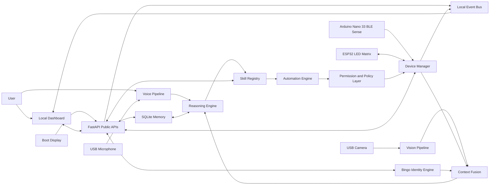
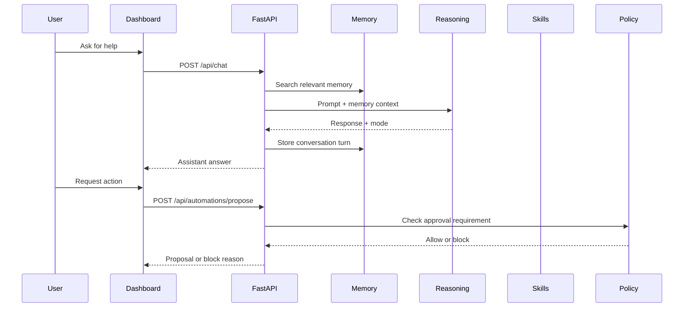

# BingoMate Architecture

## System Overview

BingoMate is a modular edge AI companion. The Jetson hosts the brain, APIs, dashboard, local memory, and hardware bridges. ESP32 and Arduino devices provide physical sensing and display surfaces. Optional cloud APIs can be used only when the user chooses them.

## Runtime Modules

| Module | Responsibility | Current Scaffold |
| --- | --- | --- |
| API | External interface and dashboard host | `bingomate/api/app.py` |
| Display | Full-screen animated Bingo kiosk UI, local boot GIF, and startup voice | `apps/bingo_display/index.html` |
| Core | Settings and local paths | `bingomate/core.py` |
| Identity | Bingo persona, privacy posture, growth signals, and system awareness | `bingomate/identity/engine.py` |
| Context | Local signal fusion and proactive suggestions | `bingomate/context/engine.py` |
| Memory | Persistent local memory, text search, and in-memory hash-vector retrieval | `bingomate/memory/store.py` |
| Reasoning | Local LLM first, optional cloud assist second, deterministic fallback last | `bingomate/reasoning/engine.py`, `bingomate/reasoning/local_adapter.py` |
| Skills | Extensible capability system | `bingomate/skills/base.py` |
| Skill Store | Persistent local template skills | `bingomate/skills/store.py` |
| Devices | Persistent device registry, signed message verification, MQTT dry-run/publish boundary, and BLE readiness status | `bingomate/devices/registry.py`, `bingomate/devices/transports.py` |
| Events | Recent event log and WebSocket fanout | `bingomate/events.py` |
| Voice | Wake word parsing, local STT adapter boundary, simulated voice turns, and local WAV speech output | `bingomate/voice/pipeline.py` |
| Vision | Simulated scenes, uploaded-image heuristics, and privacy-gated camera capture boundary | `bingomate/vision/pipeline.py` |
| Automation | Suggested actions and future execution | `bingomate/automation/engine.py` |
| Security | Approval checks and future auth | `bingomate/security/policy.py` |
| Edge Lab | Industrial telemetry bridge | `edge_lab/` |

## Data Flow

## Jetson Optimization Strategy

The scaffold starts in Python because it is fast to build and clear for contributors. Performance-sensitive modules should move behind stable interfaces:

- **C++:** camera capture, frame preprocessing, TensorRT inference loops, audio streaming, low-latency device bridges.
- **Rust:** secure local services, signed device communication, reliable long-running daemons.
- **Python:** orchestration, FastAPI, skills, notebooks, demos, and early model integration.
- **SQLite:** default local memory and device trust store; memory supports text search plus local in-memory hash-vector retrieval without external embeddings.

## Model Strategy

- **Default:** deterministic local simulation so the repo works without model downloads.
- **Local LLM path:** Jetson-optimized small LLM through a local inference service.
- **Vision path:** simulation and local image heuristics now, privacy-gated USB camera capture when explicitly enabled, then object/person/gesture models accelerated through Jetson-supported inference runtimes.
- **Voice path:** simulated wake-word path, local STT adapter boundary for OpenAI-compatible servers or command wrappers, `espeak-ng`/`espeak` WAV output when available, and offline prosody fallback for speaker checks.
- **Reasoning path:** local OpenAI-compatible/Ollama model server first when configured, deterministic fallback always available, and OpenAI APIs only when the user provides a key and explicitly chooses cloud assistance.

## Trust Boundaries

- Local user data remains on the Jetson by default.
- External API calls must be opt-in and visibly marked.
- Physical actions require explicit permission.
- Device registration should evolve toward signed identities.
- Registered devices can submit signed messages with HMAC, persisted device trust, and restart-safe replay protection.
- Future fTPM-backed Jetson identity and attestation belongs in the security roadmap.
