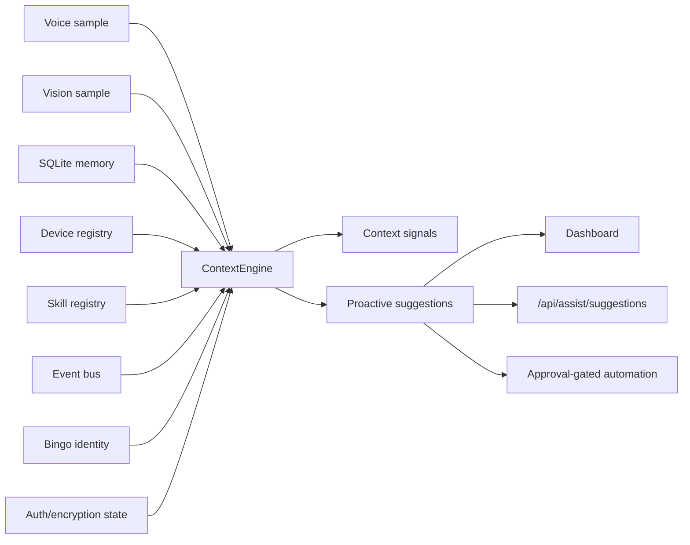

# BingoMate Context Fusion

## Purpose

Context fusion is the layer that lets Bingo act like a useful edge-native companion instead of a set of disconnected APIs. It combines local signals from voice, vision, memory, devices, skills, events, identity, and privacy posture, then produces permission-aware suggestions.

The first implementation is deterministic and simulation-safe. It does not control devices, send data externally, or execute automations.

## Runtime Flow

## Signal Sources

| Source | Current Input | Example Signal |
| --- | --- | --- |
| Voice | Simulated transcript and wake-word detection | Wake word active |
| Vision | Simulated scene, uploaded-image heuristics, or privacy-gated camera observation | Desk/lab scene with device object |
| Memory | Recent local records | Preference profile exists |
| Devices | Registry records | All nodes are still simulated |
| Skills | Built-in and template skills | Approval-gated skill profile |
| Events | Recent runtime events | Device alert-like telemetry |
| Identity | Bingo state and privacy posture | Learning or caution state |
| Privacy | Auth, host, encryption state | Memory encryption missing |

## Suggestion Rules

The current engine proposes local next steps when it detects:

- Network-visible dashboard without auth.
- Missing `BINGOMATE_AUTH_TOKEN` before demos.
- Missing `BINGOMATE_MEMORY_KEY` before sensitive memory use.
- Simulated-only hardware state.
- No user-created template skills.
- No user preference memory.
- Recent alert-like device events.
- Voice and vision context available in the same snapshot.
- Camera capture requested while camera privacy gates are disabled.

## Safety Boundary

- Suggestions are not executions.
- Physical actions still go through `POST /api/automations/propose`.
- Sensitive or physical actions remain approval-gated by `bingomate/security/policy.py`.
- The context snapshot is local-only and protected by auth when `BINGOMATE_AUTH_TOKEN` is configured.
