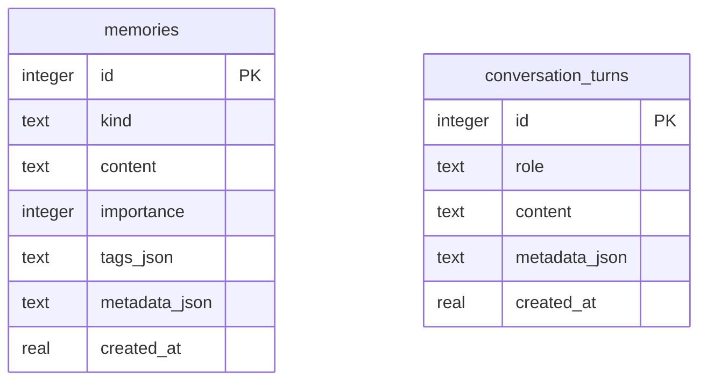

# BingoMate Memory Model

## Memory Types

- **Conversation:** user and assistant turns that support continuity.
- **Preference:** durable user choices such as privacy mode, tone, dashboard defaults, and favorite workflows.
- **Routine:** recurring patterns such as morning lab checks or demo preparation.
- **Episodic:** timestamped events from work sessions, device incidents, and user-approved observations.
- **Knowledge:** facts the user explicitly teaches BingoMate.
- **Feedback:** user corrections that improve future responses and skills.

## Storage Plan

The first implementation uses SQLite because it is reliable, local, inspectable, and available on Jetson. When `BINGOMATE_MEMORY_KEY` is configured, memory content, memory metadata, and conversation turns are encrypted before being written to SQLite. Tags remain plaintext so the dashboard can still filter without decrypting every row. Hybrid retrieval now uses local text search plus an in-memory hash-vector scorer; no external embedding model or cloud API is required.

## User Control Requirements

- Memory must be visible in the dashboard.
- User must be able to add, search, export, and delete memories through local APIs and the dashboard.
- Sensitive memory fields are encrypted at rest when `BINGOMATE_MEMORY_KEY` is configured.
- External model calls must not include memory unless the user enables that mode.
- Retention policies should be explicit, not hidden.

## Local Vector Search

BingoMate exposes vector-style memory retrieval behind stable APIs:

- `MemoryStore.add_memory(...)` remains stable.
- `MemoryStore.vector_search(...)` computes deterministic local hash vectors in memory from SQLite rows.
- `GET /api/memories/vector/status` reports vector availability and privacy behavior.
- `GET /api/memories/search` supports `text`, `vector`, and `hybrid` modes.
- No vector values are persisted by default, which avoids creating a second semantic index that could leak private content.
- Cloud embeddings remain unsupported unless a future user-approved adapter is added explicitly.
