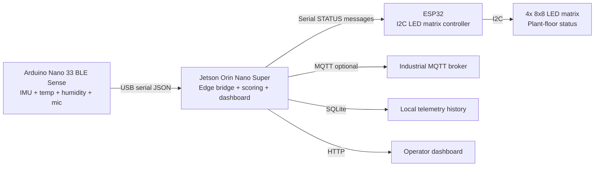

# Showcase Narrative

## One-Line Pitch

A portable Jetson-powered industrial edge gateway that turns real sensor streams into local risk signals, physical plant-floor status, and auditable telemetry.

## Demo Flow

1. Start the Jetson bridge.
2. Shake or warm the Arduino Nano 33 BLE Sense sensor node.
3. Watch the dashboard move from `OK` to `WARN` or `ALERT`.
4. Watch the ESP32 matrix update the physical status display.
5. Open the SQLite history to show local-first auditability.
6. Generate `exports/summary.md` to show the maintenance interpretation.

## Architecture

## Why It Matters

Factories and labs need edge systems that keep working when cloud links are slow, unavailable, or not allowed. This project shows the practical foundation: device bring-up, local telemetry, deterministic scoring, physical feedback, and service deployment on embedded Linux.

## Resume Bullets

- Built a Jetson Orin Nano edge gateway that ingests serial sensor telemetry, scores equipment risk locally, and exposes a live dashboard.
- Integrated Arduino Nano 33 BLE Sense telemetry with ESP32-driven I2C LED matrix status for a portable predictive maintenance demo.
- Implemented secure bring-up scripts that avoid committing Wi-Fi credentials while supporting repeatable Jetson deployment.
- Designed a roadmap for edge AI upgrades, including local anomaly modeling, MQTT telemetry, service hardening, and fleet observability.

## Upgrade Paths

- Replace rule-based scoring with a model trained on collected vibration and sound telemetry.
- Add MQTT publishing for an industrial broker.
- Add camera inference on Jetson for visual inspection.
- Add signed device identity and encrypted remote updates.
