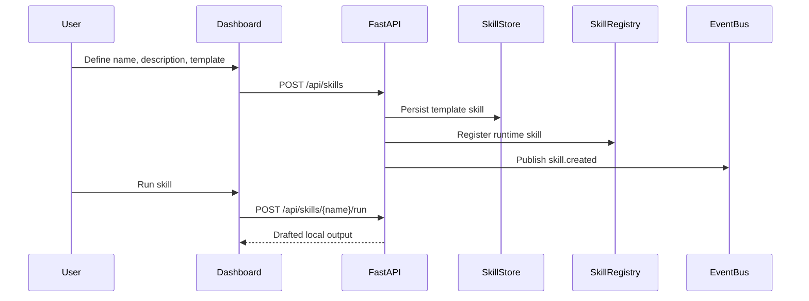

# BingoMate Skill Framework

## Current Skill Types

BingoMate supports two skill classes in the first scaffold:

- **Built-in Python skills:** version-controlled capabilities such as `echo` and `reminder_draft`.
- **Local template skills:** user-created skills persisted in SQLite that render text from `{prompt}` and `{context}` placeholders.

Template skills intentionally do not execute arbitrary Python, shell, JavaScript, or device commands. This keeps "learn new skills" useful while preserving the privacy-first and permission-first model.

## Template Skill Lifecycle

## Safety Rules

- Skill names must match `^[a-z][a-z0-9_]{2,63}$`.
- Built-in skills cannot be deleted through the public API.
- Template skills can require user approval before downstream action.
- Skill output is a draft unless a later approval-gated automation executes it.
- External API calls are not made by template skills.

## Future Skill Types

- Signed skill packages with manifest verification.
- Native Jetson skills for camera, audio, TensorRT inference, and device control.
- Permission-scoped skills such as `read_memory`, `write_memory`, `control_device`, or `use_cloud`.
- Marketplace-style skill import only after signing, review, and sandboxing are implemented.
