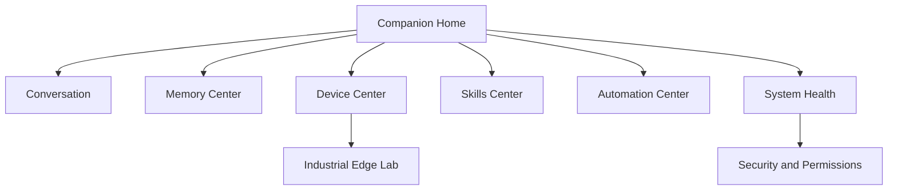

# BingoMate UX Design System

## Experience Principles

- **Calm by default:** show useful status without overwhelming the user.
- **Local-first clarity:** always reveal whether data is local, simulated, or cloud-assisted.
- **Permission before power:** automation proposals are helpful, but execution is gated.
- **Hardware-aware:** the interface should show cameras, microphones, boards, and sensors as first-class citizens.
- **Professional polish:** the product should look credible in a portfolio, demo, or lab review.

## Visual Direction

- Dark futuristic command-center aesthetic.
- Soft neon accents using cyan, violet, and green for edge AI, memory, and device health.
- Card-based layout with high contrast and readable typography.
- Subtle assistant character presence without turning the dashboard into a toy.
- Clear badges for `local`, `simulation`, `approval required`, `online`, `offline`, and `blocked`.

## Information Architecture

## Core Screens

### Companion Home

- Assistant status, simulation mode, and system health.
- Quick prompt box.
- Latest memory and device summaries.
- Recommended next action from BingoMate.

### Conversation

- Text-first chat for the scaffold.
- Future voice state: listening, thinking, speaking, muted, wake-word disabled.
- Clear memory controls: remember this, forget this, pin as preference.

### Memory Center

- Timeline of conversations, preferences, routines, and notes.
- Search and tag filters.
- Delete/export controls for user ownership.

### Device Center

- Jetson brain card.
- ESP32 matrix card.
- Arduino Nano 33 BLE Sense card.
- Optional Raspberry Pi gateway card.
- Transport indicators for serial, MQTT, BLE, REST, and WebSocket.

### Skills Center

- Installed skills list.
- Safe run button for development skills.
- Capability badges such as `read-only`, `approval required`, and `physical action`.

### Automation Center

- Proposed trigger, action, reason, and required permission.
- Approve/reject controls.
- Future audit log.

## Bingo Character Direction

Bingo should feel like a capable teammate rather than a novelty mascot:

- Friendly, concise, diligent, and lightly funny.
- Adaptable system-aware assistant character.
- Avoids overpromising and states uncertainty clearly.
- Never hides whether an action is simulated, blocked, local, or cloud-assisted.

## Boot Display

The `/display` surface is the always-on character mode for a monitor attached to the Jetson:

- Full-screen animated 3D-style Bingo presence.
- Local looping GIF avatar as a boot animation layer.
- Startup chime and browser voice that announces local readiness.
- Brain, memory, device trust, voice, and presence readiness sequence.
- Big-screen status, device count, skill count, and proactive suggestions.
- Kiosk-friendly layout that avoids exposing private memory text by default.

## Expressive Lab-Assistant, Original Execution

The requested movie reference is useful as a product archetype: expressive flying lab assistant, emotionally readable companion, and proactive helper. The implementation should avoid copying the protected character design. Bingo's original visual language should use:

- A luminous companion orb or holographic avatar rather than a yellow/black robot shell.
- State rings for listening, thinking, speaking, blocked, and approval-needed.
- Small original expression cards for delight, concern, focus, and celebration.
- A lab co-pilot tone that stays practical and avoids romantic or possessive behavior.
- Device-awareness moments, such as pulsing when the Jetson is hot or ESP32 is offline.

## Prototype Level

The first dashboard is intentionally static-build and functional through direct API calls. This keeps the project runnable on Jetson without a Node.js frontend dependency. A future React or Svelte dashboard can reuse the same API contract.
